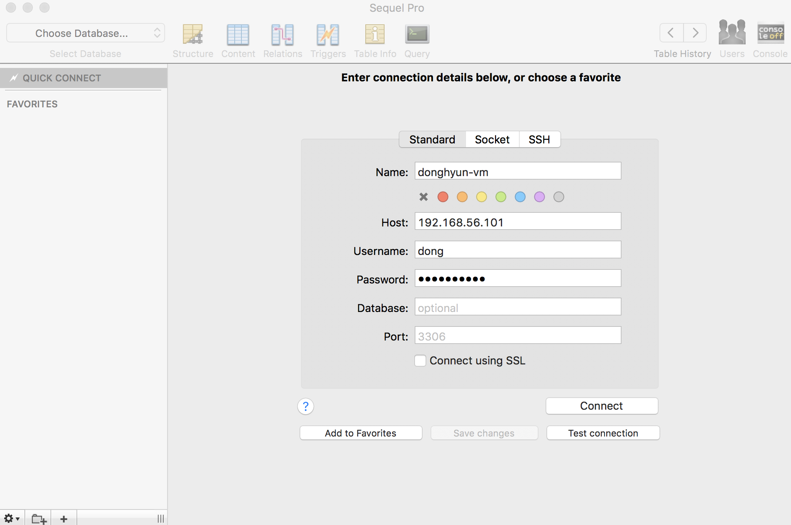

#### mysql db 생성

1. `create database [db이름];` 명령어 입렵 후 db 생성 -> `show databases;` 명령어를 통해 db 생성 확인

2. `create user '[일반 사용자 id]'@'%' identified by '[비밀번호]'` 명령어를 통해 일반 사용자 생성, '%'는 어디에서든 접근 할수 있도록 한다는 뜻

3. `grant all on [db이름]].* to '[일반 사용자 id]'@'%';` 명령어를 입력하여 일반 사용자 에게 1번에서 생성한 db의 모든 권한을 줌

4. `flush privileges;` 명령어로 권한 테이블 업데이트

5. https://www.sequelpro.com/ 에서 프로그램 설치 후 외부 접속 하여 데이터베이스 확인
> 

6. sequelpro의 query 메뉴를 통해 데이터베이스 확인
