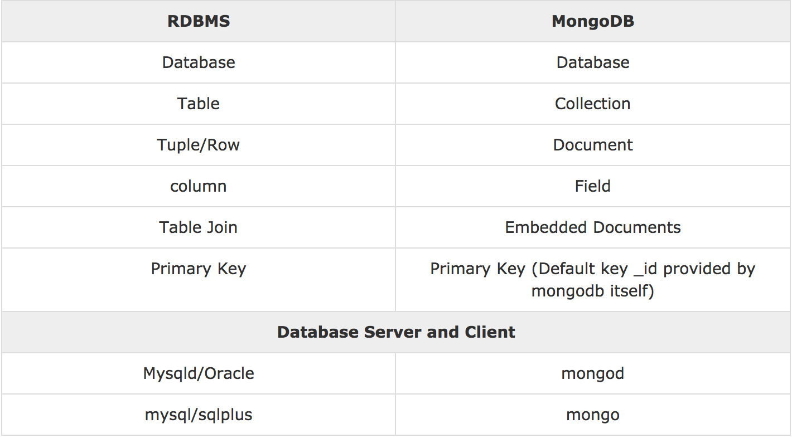
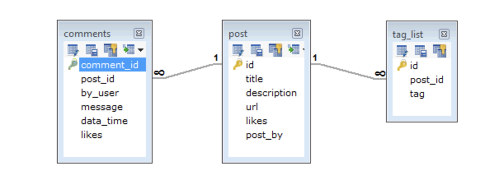
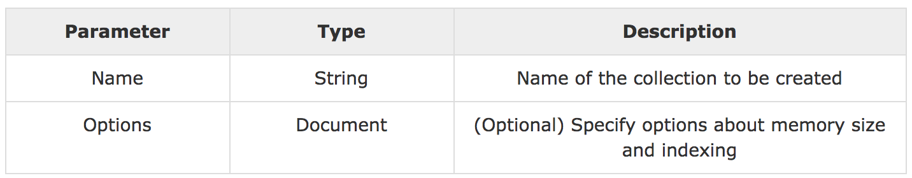
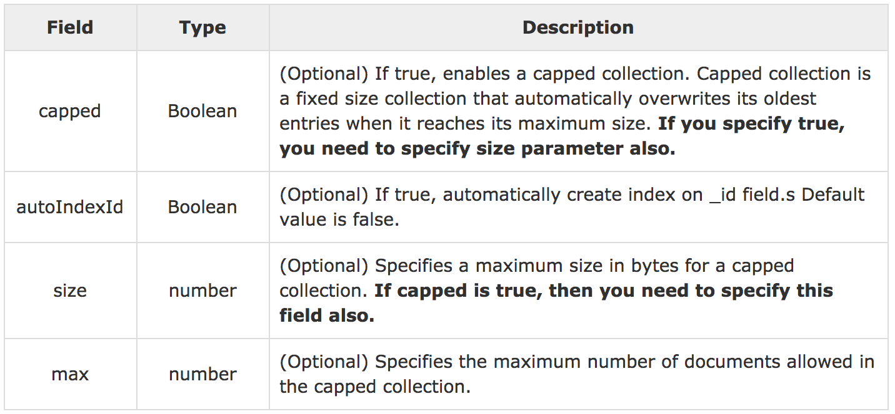
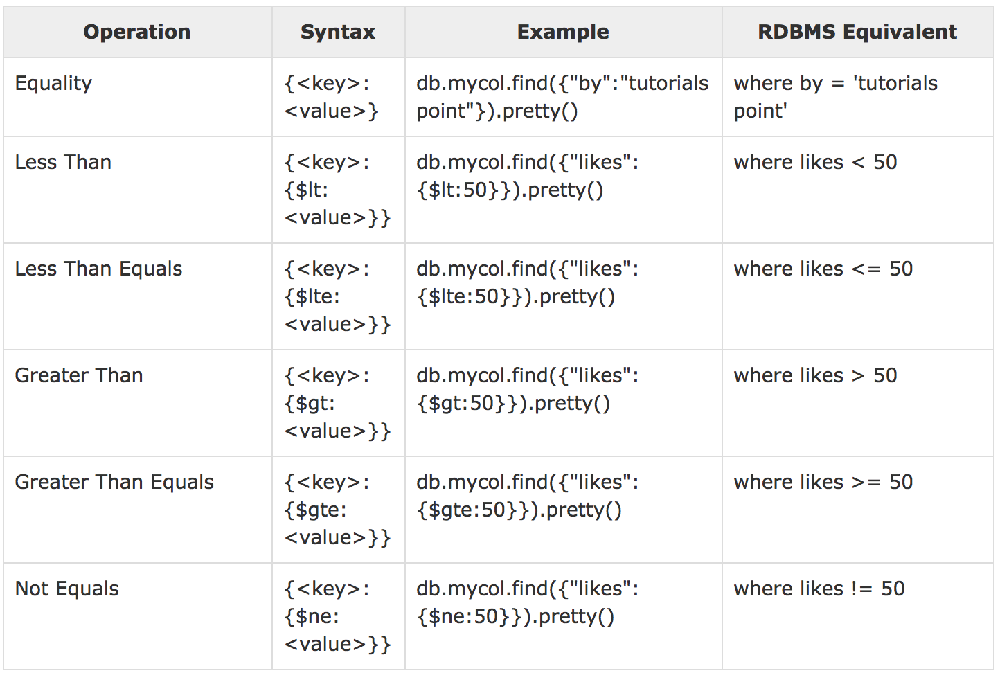

## MongoDB

### MongoDB-Overview

#### 1. Database
- database는 collections를 담는 물리적인 container이다. 각각의 database는 file system에 file들을 setting 한다.
- 일반적으로 하나의 Mongo DB 서비에는 여러 database가 존재 한다.

#### 2. Collections
- mongoDB는 document를 collections에 저장 한다. 만약 collections 가 존재 하지 않는다면 , MongoDB는 collections를 만들고 첫번째 데이터를 입력 해야 한다.
- maximum size 또는 documentation validation rules 과 같은 다양 한 룰을 적용 시켜  collections를 만들 수 있다. 
- Collection은 Mongodb documents의 그룹이다. 
- RDBMS의 테이블과 같은 역할을 한다. 
- Collection은 single database에 존재 한다. 
- Collection은 스키마 정의를 강제하지 않는다. 
- Collection 내부의 documents는 다른 field를 가진다. 일반적으로 collection의 모든 documents는 비슷하거나 서로 관련된 목적을 가지고 있다.

#### 3. Document
- document는 key-value pairs로 구성 되어 있다.
- document는 dynamic schema를 가지고 있다. 동일한 collection의 documents는 같은 set의 field와 구조를 가질 필요가 없으며 보통 field는 다른 타입을 가진  데이터를 가지고 있는다.

#### 4. RDBMS vs. MongoDB

#### 5. Document 예제
~~~javascript
{
   _id: ObjectId(7df78ad8902c)
   title: 'MongoDB Overview', 
   description: 'MongoDB is no sql database',
   by: 'tutorials point',
   url: 'http://www.tutorialspoint.com',
   tags: ['mongodb', 'database', 'NoSQL'],
   likes: 100, 
   comments: [	
      {
         user:'user1',
         message: 'My first comment',
         dateCreated: new Date(2011,1,20,2,15),
         like: 0 
      },
      {
         user:'user2',
         message: 'My second comments',
         dateCreated: new Date(2011,1,25,7,45),
         like: 5
      }
   ]
}
~~~
key와 value로 이루어져 있으며 자바스크립트의 객체와 같은 모습을 하고 있다. JOSN 데이터 형태라고도 볼 수 있다.

### MongoDB-Advantages

mongoDB는 일반적인 RDBMS의 관계를 가지고 있지 않다. mongoDB는 relations(관계)에 대한 컨셉을 가지고 있지 않다. 

#### 1. Advantages of MongoDB over RDBMS
- Schema가 존재 하지 않는다.
- 하나의 객체형태로 구조화 되어 있다.
- 복잡한 join을 필요로 하지 않는다.
- 깊은 query기능을 제공한다.
- 쉬운 scale-out
- application object에서 database object로 변환이나 매핑을 할 필요가 없다.
- 내부 메모리를 사용하여 working set의 저장과 data에 대한 접근이 빠르다.

#### 2. Why Use MongoDB?
- Document 지향 Storage : data가 JSON style의 형태로 저장 된다.
- 모든 속성에 index가 존재한다.
- 복사가 쉬우며 사용 하기 쉽다.
- 헌재의 데이터를 바르게 수정 가능하다.

#### 3. Where to Use MongoDB?
- big Data
- Content를 관리하고 전달할때 사용한다.
- 모바일 또는 사회 기반 시설.
- 사용자 데이터를 관리할때
- Data Hub

### MongoDB - Data Modelling

mongoDB의 데이터는 굉장히 유연한 구조이다. 필드 또는 구조의 같은 set을 필요로 하지 않는다.  

#### 1. Some considerations while designing Schema in MongoDB
- schemas는 당신의 요구사항에 따라 디자인 하면 된다.
- 만약 당신이 여러개의 object를 사용 하고 싶다면 하나의 document에 object들을 결합하여 사용한다. 그렇지 않다면 분리 하면 된다.(하지만 join은 필요하지 않아야한다.)
- 읽는 동안 join을 하는 것이 아니라 쓰는 동안 join 한다.
- 당신이 가장 많이 사용하는 case에 당신의 schema를 최적화 하는 것이 좋다.
- 복잡한 집계를 스키마에서 실행한다.

**RDBMS schema**

**MongoDB schema**

~~~javascript
{
   _id: POST_ID
   title: TITLE_OF_POST, 
   description: POST_DESCRIPTION,
   by: POST_BY,
   url: URL_OF_POST,
   tags: [TAG1, TAG2, TAG3],
   likes: TOTAL_LIKES, 
   comments: [	
      {
         user:'COMMENT_BY',
         message: TEXT,
         dateCreated: DATE_TIME,
         like: LIKES 
      },
      {
         user:'COMMENT_BY',
         message: TEXT,
         dateCreated: DATE_TIME,
         like: LIKES
      }
   ]
}
~~~

### MongoDB - Create Database / Drop Database

`use` 명령어를 통해 생성한 데이터베이스를 사용할 수 있다.

#### 1. Syntax
1-1. 데이터 베이스 생성
~~~
use DATABASE_NAME
~~~

1-2. 데이터 베이스 삭제
~~~
db.dropDatabase()
~~~

#### 2. Example
2-1.
- `use mydb` 명령어를 통해 `mydb` 데이터베이스를 사용한다.
- `db` 명령어는 현재 사용하는 데이터베이스를 보여준다.
- `show dbs` 명령어는 데이터베이스 리스트를 확인 할때 사용한다.
- 데이터베이스를 만들고 싶다면 collections를 생성하고 하나의 document를 넣어주어야 데이터 베이스가 생성된다.

~~~powershell
>use mydb
switched to db mydb

>db
mydb

>show dbs
local     0.78125GB
test      0.23012GB

>db.movie.insert({"name":"tutorials point"})
>show dbs
local      0.78125GB
mydb       0.23012GB
test       0.23012GB
~~~

2-2.
- 삭제할 데이터 베이스를 `use` 명령어를 통해 사용한다.
- `db.dropDatabase()`명령어를 사용하여 현재 데이터베이스를 삭제한다.
- `show dbs`명령어를 통해 해당 데이터베이스가 삭제 되었는지 확인한다.

~~~powershell
>use mydb
switched to db mydb
>db.dropDatabase()
>{ "dropped" : "mydb", "ok" : 1 }
>show dbs
local      0.78125GB
test       0.23012GB
>
~~~

### MongoDB - Create Collection

#### 1. The createCollection() Method Syntax
`db.createCollection(name, options)`을 사용하면 collection을 생성 할수 있다.

**paramater**

**options**

#### 2. Example
- `use` 명령어를 통해 원하는 데이터베이스에 접속한다.
- `db.createCollection("mycollection")`명령어를 통해 collection을 만든다.
- `show collections` 명령어를 통해 현재 생성한 collection을 확인한다.
- 다양한 option을 객체형태로 주어 collection을 만들수 있다.

~~~powershell
>use test
switched to db test
>db.createCollection("mycollection")
{ "ok" : 1 }
>show collections
mycollection
system.indexes

>db.createCollection("mycol", { capped : true, autoIndexId : true, size : 
   6142800, max : 10000 } )
{ "ok" : 1 }
>db.tutorialspoint.insert({"name" : "tutorialspoint"})
>show collections
mycol
mycollection
system.indexes
tutorialspoint
>
~~~

### MongoDB - Drop Collection
`db.collection.drop()`메소드를 사용하여 생성한 collection을 삭제 할 수 있다.

#### 1. The drop() Method Syntax

~~~powershell
db.COLLECTION_NAME.drop();
~~~

#### 2. Example
- `show collections`명령어를 통해 현재 존재하는 collections를 확인한다.
- `db.mycollection.drop()`명령어를 통해 `mycollection` 을 삭제한다.

~~~powershell
>use mydb
switched to db mydb
>show collections
mycol
mycollection
system.indexes
tutorialspoint
>db.mycollection.drop()
true
>show collections
mycol
system.indexes
tutorialspoint
>
~~~

### MongoDB - Datatypes

> null형			{ "name" : null } 
> undefined형		{ "name" : undefined } 
> boolean형			{ "name" : true } 
> 64비트 부동소숫점	{ "age" : 21 } 
> string형			{ "name" : "neo" } 
> objectId형			{ "oid" : ObjectId() } 
> date형			{ "regdate" : new Date() } 
> 정규식형			{ "name" : /neo/i } 
> javascript형		{ "func" : function() { /- ... *- } } 
> array형			{ "array" : [ 1, 2, 3 ] } 
> document형			{ "person" : { "name" : "neo" } }

### MongoDB - Insert Document

`insert()` 또는 `save()` method를 사용하여 collection에 document를 넣는다.

#### 1. The insert() Method Syntax

~~~powershell
>db.COLLECTION_NAME.insert(document)
~~~
#### 2. Example
- `db.mycol.insert()` 명령을 통해 데이터를 삽입한다.
- _id 값은 명시하지 않아도 자동으로 삽입된다.
~~~powershell
_id: ObjectId(4 bytes timestamp, 3 bytes machine id, 2 bytes process id, 
   3 bytes incrementer)
~~~
- `db.post.save(document)` 명령을 사용해도 같은 결과 제공한다.

~~~powershell
>db.mycol.insert({
   _id: ObjectId(7df78ad8902c),
   title: 'MongoDB Overview', 
   description: 'MongoDB is no sql database',
   by: 'tutorials point',
   url: 'http://www.tutorialspoint.com',
   tags: ['mongodb', 'database', 'NoSQL'],
   likes: 100
})

>db.post.save([
   {
      title: 'MongoDB Overview', 
      description: 'MongoDB is no sql database',
      by: 'tutorials point',
      url: 'http://www.tutorialspoint.com',
      tags: ['mongodb', 'database', 'NoSQL'],
      likes: 100
   },
	
   {
      title: 'NoSQL Database', 
      description: 'NoSQL database doesn't have tables',
      by: 'tutorials point',
      url: 'http://www.tutorialspoint.com',
      tags: ['mongodb', 'database', 'NoSQL'],
      likes: 20, 
      comments: [	
         {
            user:'user1',
            message: 'My first comment',
            dateCreated: new Date(2013,11,10,2,35),
            like: 0 
         }
      ]
   }
])
~~~

### MongoDB - Query Document
`find()` 메소드를 사용해서 mongodb collection에서 데이터를 찾아올수 있다.

#### 1. The find() Method Syntax
~~~powershell
>db.COLLECTION_NAME.find()
~~~

#### 2. Example
- `find()` 명령을 통해 colloction의 데이터를 가져 올수 있다.
- `pretty()` 메소드를 통해 가져온 데이터를 좀 더 보기쉽게 확인 할수 있다.
- `findOne()` 명령을 사용하면 하나의 데이터만 가져온다.

~~~powershell
>db.mycol.find().pretty()
{
   "_id": ObjectId(7df78ad8902c),
   "title": "MongoDB Overview", 
   "description": "MongoDB is no sql database",
   "by": "tutorials point",
   "url": "http://www.tutorialspoint.com",
   "tags": ["mongodb", "database", "NoSQL"],
   "likes": "100"
}
~~~

**RDBMS의 조건문과 비교**

2-1. AND in MongoDB
- `find()` 메소드 안에서 사용하는 조건문으로 `$and:`를 사용하여 조건문을 사용할 수 있다.

~~~powershell
>db.mycol.find(
   {
      $and: [
         {key1: value1}, {key2:value2}
      ]
   }
).pretty()

>db.mycol.find({$and:[{"by":"tutorials point"},{"title": "MongoDB Overview"}]}).pretty();
{
   "_id": ObjectId(7df78ad8902c),
   "title": "MongoDB Overview", 
   "description": "MongoDB is no sql database",
   "by": "tutorials point",
   "url": "http://www.tutorialspoint.com",
   "tags": ["mongodb", "database", "NoSQL"],
   "likes": "100"
}
>
~~~

2-2. OR in MongoDB
- `find()` 메소드 안에서 사용하는 조건문으로 `$or:`를 사용하여 조건문을 사용할 수 있다.

~~~powershell
>db.mycol.find(
   {
      $or: [
         {key1: value1}, {key2:value2}
      ]
   }
).pretty()

>db.mycol.find({$or:[{"by":"tutorials point"},{"title": "MongoDB Overview"}]}).pretty()
{
   "_id": ObjectId(7df78ad8902c),
   "title": "MongoDB Overview", 
   "description": "MongoDB is no sql database",
   "by": "tutorials point",
   "url": "http://www.tutorialspoint.com",
   "tags": ["mongodb", "database", "NoSQL"],
   "likes": "100"
}
>
~~~

2-3. AND, OR in MongoDB
- AND 와 OR을 같이 사용 할수 있다.
- 밑의 예제는 RDBMS의 `where likes>10 AND (by = 'tutorials point' OR title = 'MongoDB Overview')` SQL과 같다.

~~~powershell
>db.mycol.find({"likes": {$gt:10}, $or: [{"by": "tutorials point"},
   {"title": "MongoDB Overview"}]}).pretty()
{
   "_id": ObjectId(7df78ad8902c),
   "title": "MongoDB Overview", 
   "description": "MongoDB is no sql database",
   "by": "tutorials point",
   "url": "http://www.tutorialspoint.com",
   "tags": ["mongodb", "database", "NoSQL"],
   "likes": "100"
}
>
~~~

## MongoDB - Update Document
- `update()`메소드를 사용하여 데이터를 수정 할수 있다.

#### 1. MongoDB Update() Method Syntax
~~~powershell
>db.COLLECTION_NAME.update(SELECTION_CRITERIA, UPDATED_DATA)
>db.COLLECTION_NAME.save({_id:ObjectId(),NEW_DATA})
~~~

#### 2. Example
- 수정한 데이터를 먼저 찾은후, 두번째 파라메터의 값으로 바꾸어 준다.
- `$set:`을 통해 데이터를 수정한다.

현재 입력되어있는 데이터
~~~powershell
>db.mycol.find()
{ "_id" : ObjectId(5983548781331adf45ec5), "title":"MongoDB Overview"}
{ "_id" : ObjectId(5983548781331adf45ec6), "title":"NoSQL Overview"}
{ "_id" : ObjectId(5983548781331adf45ec7), "title":"Tutorials Point Overview"}
>db.mycol.update({'title':'MongoDB Overview'},{$set:{'title':'New MongoDB Tutorial'}})
>db.mycol.find()
{ "_id" : ObjectId(5983548781331adf45ec5), "title":"New MongoDB Tutorial"}
{ "_id" : ObjectId(5983548781331adf45ec6), "title":"NoSQL Overview"}
{ "_id" : ObjectId(5983548781331adf45ec7), "title":"Tutorials Point Overview"}
>
~~~

- `save()` 명령어를 사용해서 바꿀수도 있다.
- `_id:ObjectId()`의 값으로 해당 데이터를 찾고 두번째 인자로 보내준 값으로 수정 한다.

~~~powershell
>db.mycol.save(
   {
      "_id" : ObjectId(5983548781331adf45ec7), "title":"Tutorials Point New Topic",
         "by":"Tutorials Point"
   }
)
>db.mycol.find()
{ "_id" : ObjectId(5983548781331adf45ec5), "title":"Tutorials Point New Topic",
   "by":"Tutorials Point"}
{ "_id" : ObjectId(5983548781331adf45ec6), "title":"NoSQL Overview"}
{ "_id" : ObjectId(5983548781331adf45ec7), "title":"Tutorials Point Overview"}
>
~~~

### MongoDB - Delete Document
`remove()`명령을 통해 데이터를 삭제한다.
> - deletion criteria − (Optional) 해당 조건에 맞는 데이터를 삭제한다.
> - justOne − (Optional) 두번째 parameter로 `ture` 또는 `1`을 넘겨 주면 오직 하나의 document를 삭제한다.

#### 1. The remove() Method Syntax
~~~powershell
>db.COLLECTION_NAME.remove(DELLETION_CRITTERIA)
>db.COLLECTION_NAME.remove(DELETION_CRITERIA,1)
>db.mycol.remove()
~~~

#### 2. Example
- document를 삭제 할때 `remove()` 메소드의 첫번째 인자로 `{'title':'MongoDB Overview'}` 와 같은 조건을 주면 해당 조건에 맞는 document는 모두 삭제 된다.
- 두번 째 인자로 `true` 또는 `1`을 넘겨주면 첫번째 인자 조건에 맞는 첫번째 document만 삭제한다.
- 아무런 인자도 넘겨주지 않으면 collection의 모든 데이터가 삭제 된다.

~~~powershell
>db.mycol.find()
{ "_id" : ObjectId(5983548781331adf45ec5), "title":"MongoDB Overview"}
{ "_id" : ObjectId(5983548781331adf45ec6), "title":"NoSQL Overview"}
{ "_id" : ObjectId(5983548781331adf45ec7), "title":"Tutorials Point Overview"}
>db.mycol.remove({'title':'MongoDB Overview'})
>db.mycol.find()
{ "_id" : ObjectId(5983548781331adf45ec6), "title":"NoSQL Overview"}
{ "_id" : ObjectId(5983548781331adf45ec7), "title":"Tutorials Point Overview"}
>db.COLLECTION_NAME.remove({'title':'NoSQL Overview'},1)
>db.mycol.find()
{ "_id" : ObjectId(5983548781331adf45ec7), "title":"Tutorials Point Overview"}
>db.mycol.remove()
>db.mycol.find()
>
~~~

### 참조
- https://www.tutorialspoint.com/mongodb 해석

