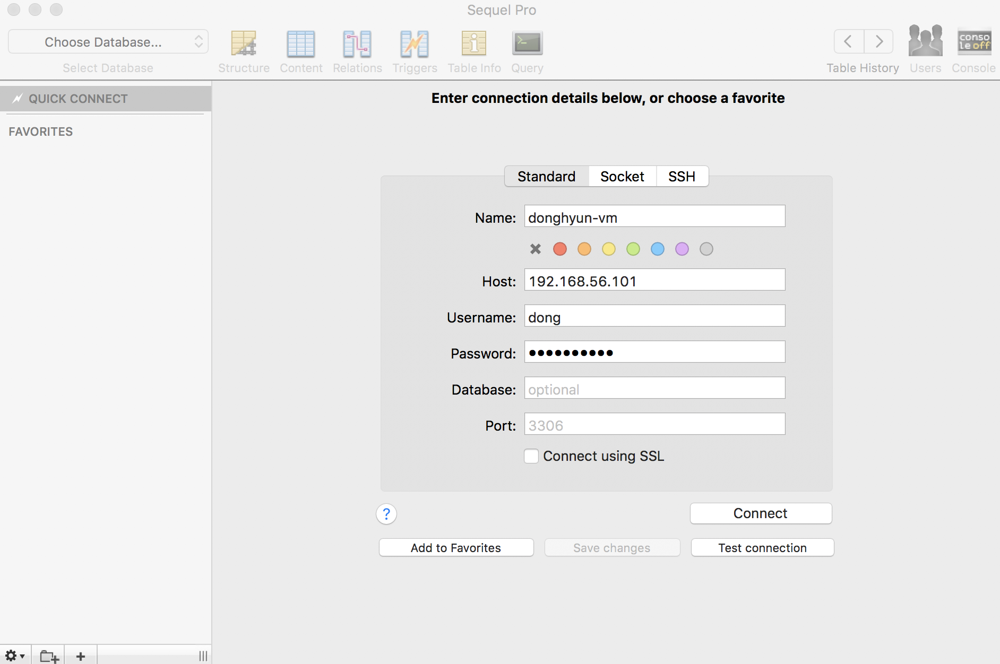

#### mysql db 생성

1. `create database [db이름];` 명령어 입렵 후 db 생성 -> `show databases;` 명령어를 통해 db 생성 확인

2. `create user '[일반 사용자 id]'@'%' identified by '[비밀번호]'` 명령어를 통해 일반 사용자 생성, '%'는 어디에서든 접근 할수 있도록 한다는 뜻

3. `grant all on [db이름]].* to '[일반 사용자 id]'@'%';` 명령어를 입력하여 일반 사용자 에게 1번에서 생성한 db의 모든 권한을 줌

4. `flush privileges;` 명령어로 권한 테이블 업데이트

5. https://www.sequelpro.com/ 에서 프로그램 설치 후 외부 접속 하여 데이터베이스 확인
> 

6. sequelpro의 query 메뉴를 통해 데이터베이스 확인

#### DBMS는 왜 사용 하는가?
1. DBMS : DataBaseManagementSystem, 데이터베이스를 관리하는 소프트웨어. ex) oracle, mysql...
   Data : 컴퓨터에 저장할 수 있는 어떤 것
    Database : 데이터의 집합, 데이터를 모아 놓고 사용 할수 있는 것.

2. DIKW 피라미드
> 

- Data --- 가공 ---> information(정보)  --- 가공 ---> Knowledge(정보중 의미있고, 유용한 insight 제공) --- 가공 ---> Wisdom(Knowledge중 어떤 단체의 결정에 큰 영향을 미치는 것)

- 빅데이터를 이용한 머신러닝, 딥 러닝의 목표는 information으로  Knowledge,Wisdom을 만드는 것이다.

3. RDBMS (Relational Database Management System) - 관계형 데이터 베이스
- RDB : 관계형 데이터 모델에 기초를 둔 데이터베이스 이다. 가장 많이 쓰이며 기초적으로 알아야 하는 데이터 베이스이다.
- RDBMS : 관계형 데이터베이스를 생성하고 수정하고 관리할 수 있는 소프트웨어라고 정의
   데이터베이스는 테이블이라는 최소 단위로 구성 되어있고 테이블은 하나이상의 열로 구성되어있다.

4. SQL (Structured Query Language)
- 관계형 데이터 베이스에서 데이터 조작시 사용
- 선언적 언어 : 순서가 아닌 what(무엇)을 할지 정의 하는 언어이다.
- RDBMS에 서 많이 사용된다.

5. NOSQL(Not Only SQL)
- 관계형 데이터 베이스가 아닌 나머지 데이터 베이스 
- 그래프 DB, 도큐먼트 DB등... 
   ex) MongoDB, Redis, DyanmoDB...
- 관계형 데이터 베이스를 사용하기 업력거나 굳이 사용해야 하는가 라고 생각시에 사용된다.

6. **데이터 베이스 관련용어**
- CAP
   - Consistency(일관성) : 데이터의 일관적 저장
   - Availability(가용성) : 얼마나 down time 없이 서비스가 운영 되는가?
   - Partition Tolerence : 여러대의 서비스를 운영하고 있을때, 일부 서버가 망가져도 전체에 영향을 미치지 않는 것이 중요하다.
   - 세가지 모든 조건이 충족 되기는 어렵다.

- **ACID**(검색)
  - Atomicity(원자성) : All of nothing, 데이터 transaction시 전부 저장이 되거나 아에 안되는 것
  - Consistency(일관성) : 한쪽에서 데이터 변경시 바로 다른쪽 에서도 사용 가능, CRUD시 다른 사용자에게도 똑같이 보인다.
  - Isolation(고립성) : 여러명이 사용하지만 한명이 사용하는 것처럼 무결성을 보장한다.
  - Durabilitry(내구성) : 한번 사용한 데이터를 안전하고 영구적 저장이 되는 가? 
  - 확장성
  - 수평확장 : 서버를 여러대 둔다.
  - 수직확장 : 물리적인 컴퓨터의 성능을 높인다.(돈이 많이 듦)
7. SQL VS NoSQL
- CAP : NoSQL은 CAP중 몇가지 만족을 위해 만들어짐
- ACID :  RDBMS가 가지고 있는 특성
- Transaction  : RDB가 지원 하는 형식, transaction의 성질은 ACID가 가짐 (검색)
- 확장성 : RDB - 수직 확장, NoSQL : 수평확장

8. Graph DB
- 복잡한 관계를 처리한다. (친구 추천 알고리즘, sns에 적합)
> 

9. Document DB
- JSON 기반의 데이터를 저장
- MongoDB
   장점 : json 기반, 아무거나 저장, 비교적 빠르고 사용이 간단한다.
    단점 : 조인에 부적합하다.
10. Key-Value DB
- 엄청빠르다, 단순데이터 처리, 캐시 / 데이터 분산용, 웹의 session 저장용 DB에서 사용됨.
- Redis...

11. Cloud DB
- 설치가 필요 X, 사용이 쉽고 편리한편, 고성능, 고가용성, 내구도 
- Cloud vender가 제공해서 더욱 쉽게 사용할 수 있다.
- KV store, Doc store등 다양한 기능 사용가능

#### 식별관계 비 식별관계

