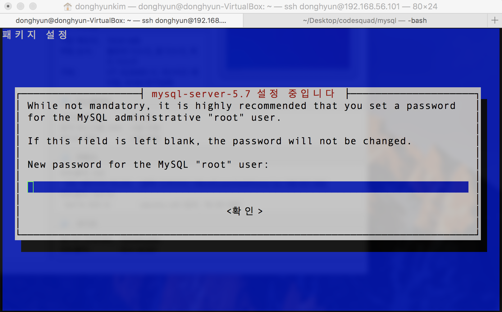

#### mysql 설치 과정

1. 맥 터미널 실행 -> `ssh donghyun@192.168.56.101` 명령어를 통해 lubuntu 접속.

2. `sudo apt install mysql-server` 입력 및 mysql 설치
> Tip. 만약 lubuntu의 네트워크에 vat가 설정이 안되어있다면 인터넷과 연결이 되지 않기 때문에 설정을 꼭 해줄것!

3. root 패스워드 입력
> 주의. 꼭 root password 를 입력하고 잊어버리지 말아야한다.
> 

4. `sudo service mysql start` 명령어를 통해 mysql 서버를 실행 시킴

5. `sudo update-rc.d mysql defaults` 명령어를 입력하면 서버가 재실행이 되도라도 자동으로 mysql 서버를 실행

6. `mysql -u root -p` 명령어 입력 후 root 비밀번호를 입력 -> `mysql>` 가 제공 되면 정상 설치완료

7. mysql 한글설정
  - `cd /etc/mysql` 폴더 이동 -> `sudo vi mysql.conf.d/mysqld.cnf`파일 열기 후 https://github.com/honux77/practice/wiki/mysql-ko-utf8 내용 추가 -> `sudo service mysql restart` 명령어를 통해 서버 재시작
  -  Tip. `sudo apt install tree` 플러그인 설치. 폴더의 tree 구조를 보여줌

8. `grep -r "bind"` 명령어 입력 -> `sudo vi mysql.conf.d/mysqld.cnf` 입력 후 bind-address 부분 앞 "#" 을 입력 하여 주석 처리
->  외부 접속 가능 -> `sudo service mysql restart` 명령어를 통해 서버 재시작
