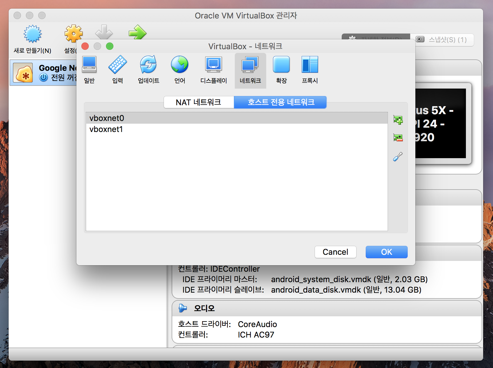
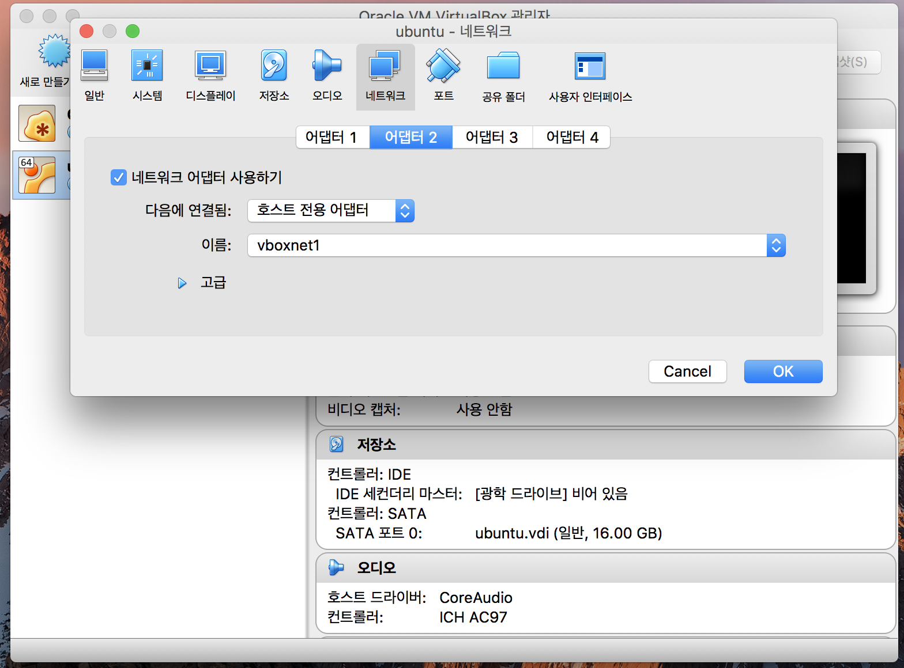
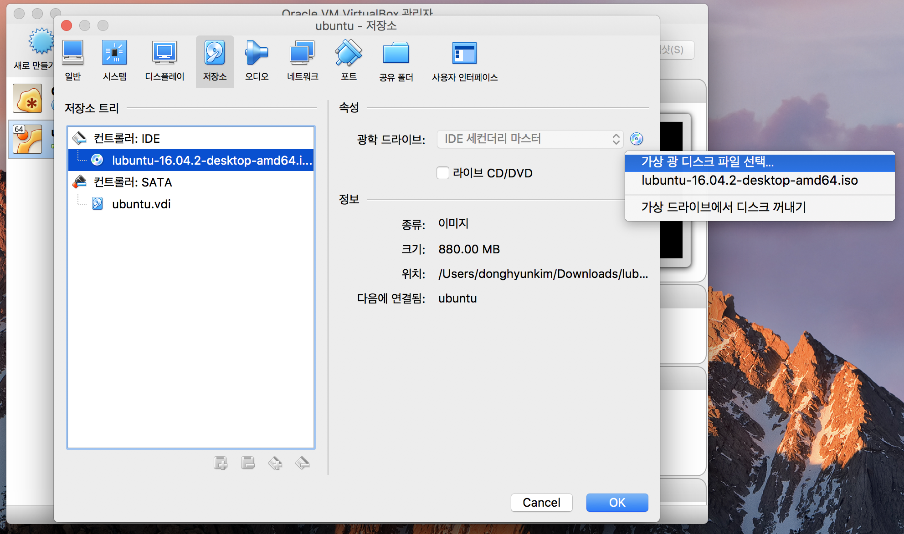
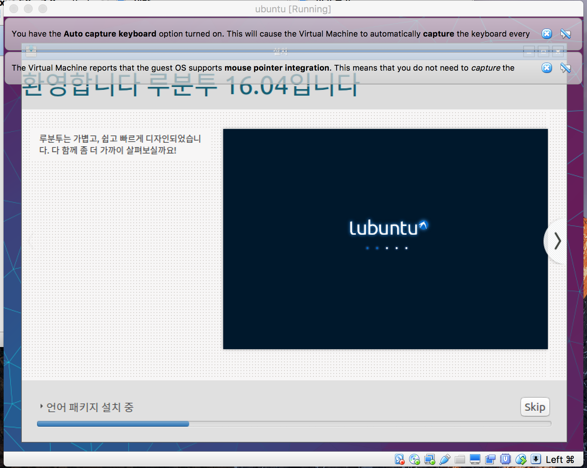
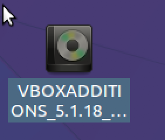
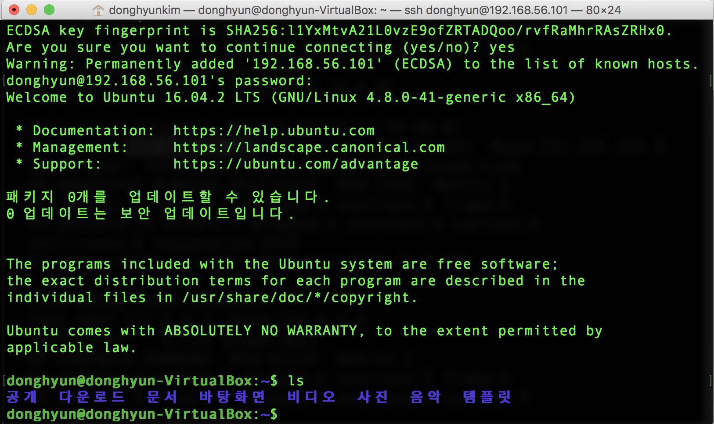

#### lubuntu/mysql 설치 과정

1. virtual box 설치
https://www.virtualbox.org

2. host전용 네트워크를 설치

3. virtualbox -> 환경 설정 -> 네트워크 -> 호스트 전용 네트워크  
> 

4. lubutu Linux 설치
> http://cdimage.ubuntu.com/lubuntu/releases/16.04/release/lubu ntu‐16.04.2‐desktop‐amd64.iso 
> LTS : 안정화 버전, Long Term Support: 지원이 오래되는 버전. 16.04 버전

5. virtualbox -> 새로만들기 : 가상의 컴퓨터를 하나 만드는 것이다. 가상의 컴퓨터 위에 우분투를 설치 하는 것이다. 메모리는 1G, 하드 16G 정도면 무난하다.

6. virtualbox -> 설정 -> 네트워크 -> 어뎁터2 -> 전에 만든 호스트전용 네트워크 설정 : 만들어진 가상 pc를 설정한다, 무선 랜카드를 설치 하는 것이다. 하나는 인터넷 통신, 하나는 내 본래 mac과 연결하는 랜카드이다.
>

7. virtualbox -> 저장소 -> cd모양 클릭 -> 가상 광디스크 파일 선택 -> lubuntu iso 파일 설정 -> 시작
>

8. lubuntu 가상컴퓨터 실행 -> lubuntu 설치
>

9. lubuntu의 lx 터미널 실행 -> `sudo apt update` 입력 -> `sudo apt -y upgrade` 입력 후 업데이트 및 업그레이드 완료 -> `sudo reboot` 입력 후 재부팅

10. **virtualbox guest plugin 설치** : 상단 메뉴의 divice 선택 -> insert guest addition ... 선택 -> vboxaddtion... 폴더 선택 후 주소 복사 -> lxterminal 에서 `cd 복사한 주소` 입력 -> 해당 폴더로 들어간후 `sudo apt install build-essential` 입력 후 bulid essential 패키지 설치 -> `sudo ./VBoxLinuxAdditions.run` 입력 후 재부팅
>

11. **ssh 설정** : lxterminal 열기 -> `ifconfig` 또는 `ifconfig | grep inet` 명령어 입력 ->  `sudo apt install openssh-server` 플러그인 설치 -> 맥 터미널 실행 -> `ssh donghyun(리눅스컴퓨터이름)@192.168.56.101(주소)` 입력 후 맥에서 ssh통해 맥에서 리눅스 접속  

> Tip. 10. 으로 시작하는 주소는 인터넷용 주소, 192. 로 시작하는 주소는 pc 밖에서 사용할때 사용 
>
